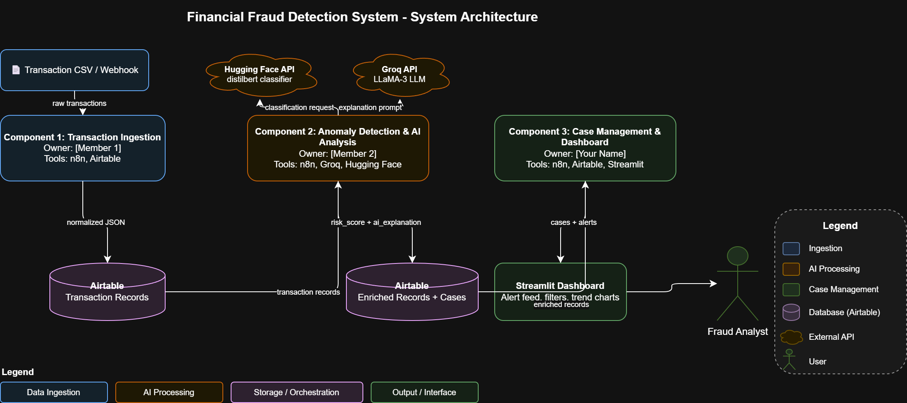

# Financial Fraud Detection System

An AI-assisted financial fraud detection pipeline that ingests transaction data, analyzes risk, generates plain-English fraud explanations, and gives analysts a Streamlit dashboard for reviewing and managing investigation cases.

## Team

| Name | Component | GitHub |
|---|---|---|
| Ergi Sula | Transaction Ingestion | @ErgiS13 |
| Thomas Kamel | Anomaly Detection & AI Analysis | @thomaskamel |
| Andrew Skoblov & Ergi Sula | Case Management & Dashboard | @andrewskoblov |

## Problem

Financial institutions process large volumes of transactions every day. Analysts need a faster way to identify suspicious activity, understand why a transaction was flagged, and manage follow-up investigations without manually sorting through every record.

This project solves that by connecting three components:

1. Transaction ingestion
2. Anomaly detection and AI explanation
3. Case management and dashboard review

## Architecture



## Components

### Component 1: Transaction Ingestion

**Owner:** Ergi Sula  
**Tools:** n8n, Airtable  
**Purpose:** Parse simulated transaction data and store normalized records in Airtable.

**Output fields include:** `transaction_id`, `amount`, `timestamp`, `account_id`, `merchant`, and `location`.

### Component 2: Anomaly Detection & AI Analysis

**Owner:** Thomas Kamel  
**Tools:** n8n, Groq, Hugging Face  
**Purpose:** Analyze transactions for unusual patterns and generate a human-readable fraud explanation.

**Output fields include:** `risk_score`, `anomaly_flags`, and `ai_explanation`.

### Component 3: Case Management & Dashboard

**Owner:** Andrew Skoblov & Ergi Sula 
**Tools:** Airtable, Streamlit, Python  
**Purpose:** Give analysts a dashboard to review high-risk cases, filter alerts, update statuses, assign cases, create manual cases, export case data, and view fraud trends.

Dashboard folder: [`case-management-dashboard`](case-management-dashboard)  
Dashboard app: [`case-management-dashboard/dashboard.py`](case-management-dashboard/dashboard.py)

## Quick Links

- Case management dashboard: [`case-management-dashboard/`](case-management-dashboard)
- Transaction ingestion component: [`transaction-ingestion/`](transaction-ingestion)
- n8n workflow exports: [`workflows/`](workflows)
- Sample data: [`data/transactions_sample.csv`](data/transactions_sample.csv)
- Project docs: [`docs/`](docs)
- Prompt logs: [`docs/prompt-logs/`](docs/prompt-logs)

## Dashboard Quick Start

```bash
cd case-management-dashboard
pip install -r requirements.txt
set AIRTABLE_TOKEN=your_personal_access_token
set AIRTABLE_BASE_ID=appOBt37iEsQy2Nbd
streamlit run dashboard.py
```

On macOS/Linux, use `export` instead of `set`.

Full dashboard setup and presentation instructions are in [`case-management-dashboard/README.md`](case-management-dashboard/README.md).

## Dashboard Demo Flow

For a short project presentation, show the dashboard in this order:

1. **Overview:** explain the total transactions, analyzed transactions, escalated transactions, and open cases.
2. **Alert Queue:** filter by risk score, open a high-risk case, show the AI explanation, and update the status.
3. **Case Manager:** show the full cases table, export CSV button, and manual case creation form.
4. **Analytics:** show risk distribution, transaction status breakdown, top flagged merchants, and top flagged locations.

Suggested talk track:

> “My component turns AI-scored transactions into an analyst workflow. Instead of only seeing a risk score, the analyst can review cases, read the AI explanation, assign ownership, resolve cases, and monitor trends from one dashboard.”

## Data Sources

- Simulated transaction records for testing
- Airtable tables for shared component data
- CSV sample data in [`data/transactions_sample.csv`](data/transactions_sample.csv)

## Success Criteria

1. Ingestion workflow stores transaction records in Airtable.
2. AI analysis flags suspicious transactions and writes risk scores/explanations.
3. Dashboard displays the case queue with working filters.
4. Analysts can update case status and assignee from the dashboard.
5. The three components exchange data through the shared Airtable base.

## Repository Layout

```text
.
├── case-management-dashboard/
│   ├── dashboard.py
│   ├── requirements.txt
│   └── README.md
├── transaction-ingestion/
├── workflows/
│   ├── anomaly-detection-ai-enrichment.json
│   └── transaction-ingestion.json
├── data/
│   └── transactions_sample.csv
├── docs/
│   ├── component-notes/
│   ├── prompt-logs/
│   └── proposal.md
├── architecture.png
├── LICENSE
└── README.md
```

## Notes

- Airtable credentials are not stored in this repository.
- Set `AIRTABLE_TOKEN` locally or through Streamlit secrets before running the dashboard.
- The dashboard refreshes Airtable data every 30 seconds through Streamlit caching.
