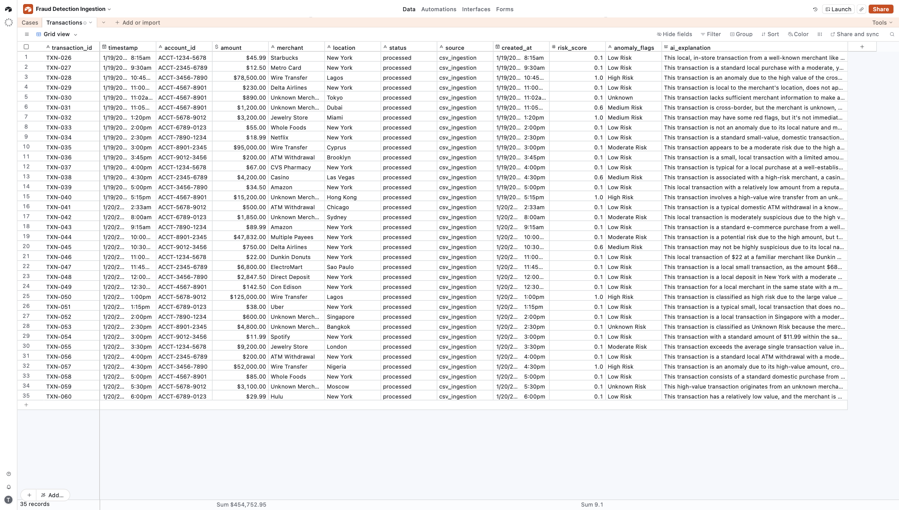

# Autonomous Financial Fraud Detection & AI Enrichment Pipeline

An automated backend data engineering pipeline that ingests financial transactions, orchestrates conditional routing logic, evaluates fraud indicators using Large Language Models (LLMs), and dynamically synchronizes real-time security logs back to a relational data store.

## 🚀 Architecture Overview

This project orchestrates multiple AI models and data systems into a unified, fault-tolerant asynchronous loop:

1. **Data Ingestion:** Automatically queries an Airtable database to batch-fetch records flagged as unprocessed.
2. **Context-Aware Routing:** Uses a loop controller and conditional branching logic to evaluate transactions dynamically based on transactional thresholds and metadata.
3. **LLM Reasoning & Structured Scoring:** Integrates a Llama-3.1 model running over high-throughput inference (Groq API). The prompt engineering enforces a strict data contract, outputting a parsed sequence of risk categories (`High Risk`, `Medium Risk`, `Low Risk`, `Unknown Risk`), calculated confidence metrics, and concise, 2-sentence security explanations.
4. **Data Synchronization:** Employs a runtime JavaScript string-splitting engine to parse the LLM's unified payload, executing real-time updates back to Airtable, updating transaction states to `processed`, and populating the monitoring dashboard.

---

## 📊 System Evaluation & Live Output

To validate the production readiness and accuracy of the logic, a diverse batch of financial transaction types—ranging from standard retail spending to high-value cross-border wires—was executed through the pipeline. 

### 1. Live Database View
Below is the live tracking view of the synchronized Airtable schema, confirming successful execution checkmarks, threat tier allocations, and state transitions:

### 2. Live Pipeline Data Log
The following table reflects the actual runtime output extracted directly from the system's successful execution loop, showcasing perfect alignment between the risk tags, risk scores, and generated summaries:

| Transaction ID | Account Number | Amount | Merchant | Location | Status | Risk Score | Risk Tag | AI Security Explanation |
| :--- | :--- | :--- | :--- | :--- | :--- | :--- | :--- | :--- |
| **TXN-026** | ACCT-1234-5678 | $45.99 | Starbucks | New York | `processed` | 0.1 | Low Risk | This transaction is a local, low-value transaction at a well-established merchant like Starbucks, making it a typical and expected pattern, thus minimizing fraud risk. |
| **TXN-027** | ACCT-2345-6789 | $12.50 | Metro Card | New York | `processed` | 0.6 | Medium Risk | This transaction is a local small transaction in New York, but the amount is higher than the average local transaction, increasing the risk of potential fraud. |
| **TXN-028** | ACCT-3456-7890 | $78,500.00 | Wire Transfer | Lagos | `processed` | 1.0 | High Risk |
